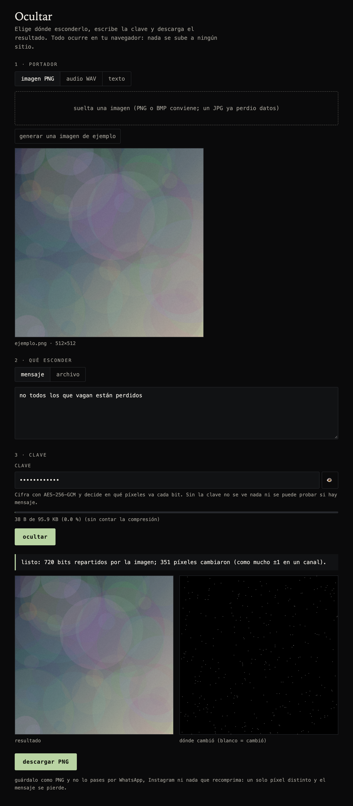
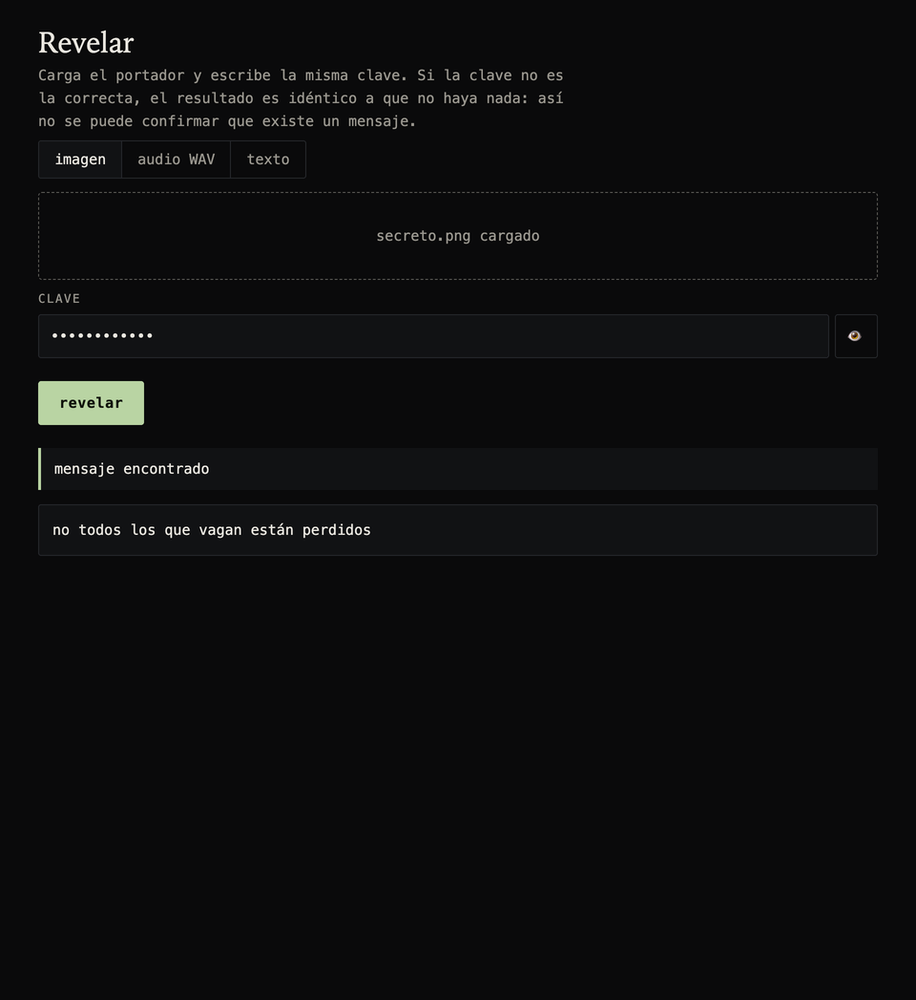
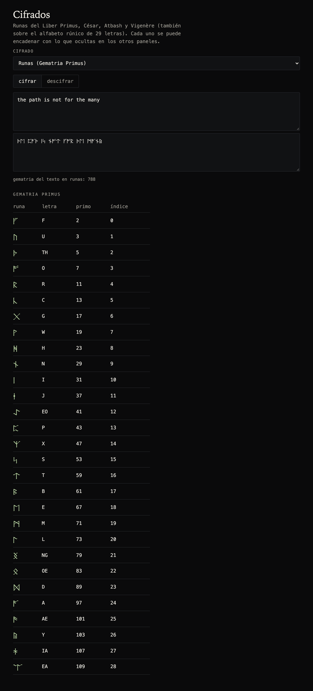
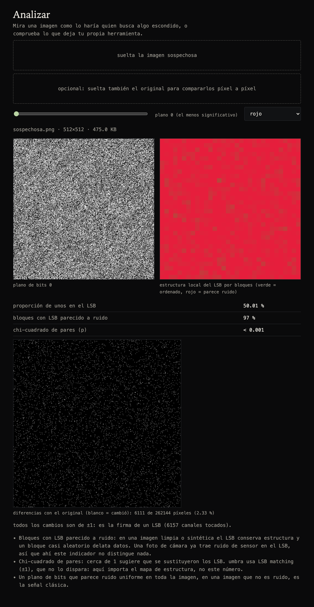

# umbra

laboratorio modular de esteganografía en el navegador: esconde mensajes y archivos dentro de imágenes, audio y texto, con cifrado y con los bits repartidos por una clave. inspirado en los acertijos de cicada 3301 (runas, gematria primus, capas), sin relación con ellos. todo se procesa en tu equipo: no hay servidor.

**probarlo:** https://kisnner26.github.io/umbra/

## qué hace

### ocultar
- **imagen PNG**: el mensaje va en el bit menos significativo de los canales RGB, con *LSB matching* (suma o resta 1 en vez de forzar el bit) y en un orden que solo sabe quien tiene la clave. cambia como mucho ±1 por canal.
- **audio WAV**: lo mismo sobre las muestras de 16 bits, sin saltos audibles en los extremos.
- **texto**: caracteres invisibles repartidos por una frase de portada; se ve igual.
- esconde texto o **cualquier archivo** (otra imagen, un zip). se comprime solo si ahorra bytes. te dice cuánto cabe.



### revelar
- con la clave correcta sale el mensaje. con una incorrecta el resultado es idéntico a que no haya nada: **no se puede confirmar que existe un mensaje**.



### cifrados
- runas del liber primus con los valores primos de la gematria, césar, atbash y vigenère (también sobre el alfabeto de 29 runas). la lista está en un solo archivo: añadir uno es añadir un objeto.



### analizar
- planos de bits, mapa de estructura del LSB, chi-cuadrado de pares y, si tienes el original, la comparación píxel a píxel. sirve para atacar tus propios mensajes y ver qué delatan.



## cómo funciona

1. la carga (tipo, nombre, datos) se comprime si compensa y se cifra con **AES-256-GCM**; la clave sale de **PBKDF2-SHA256** (200 000 iteraciones). sin clave solo se ofusca.
2. una segunda semilla, también derivada de la clave, ordena una permutación de Fisher–Yates de todas las ranuras del portador: cada bit va a una posición distinta y repartida por todo el archivo.
3. cada ranura es un LSB; se escribe con LSB matching (sin sesgo en el histograma de pares).
4. al leer se recorre la misma permutación: primero la longitud, luego el cuerpo. si la etiqueta GCM no coincide, no hay mensaje con esa clave.

el motor (`js/core`) trabaja sobre "ranuras" abstractas: añadir un portador nuevo (otro formato) es escribir una clase con `slots`, `getBit` y `setBit`.

## límites, con honestidad

- **el formato tiene que ser sin pérdida.** un JPG, WhatsApp, Instagram o cualquier recompresión destruyen el mensaje. guarda y comparte el PNG o el WAV tal cual.
- el LSB matching no lo detecta el chi-cuadrado clásico, pero **con el original delante se ve la diferencia** (el panel analizar lo muestra). esconder no es lo mismo que ser indetectable frente a un análisis dirigido.
- el texto con caracteres invisibles lo limpian algunos sitios (redes, editores) y cualquier herramienta de Unicode lo muestra.
- la seguridad del cifrado depende de la clave: una frase larga y única.
- no hay capas múltiples con negación plausible (varios mensajes en el mismo archivo con claves distintas): sería la siguiente pieza.

## desarrollo

```bash
npm test                      # 46 pruebas del motor, los portadores, los cifrados y el análisis
python3 -m http.server 8080   # servir la carpeta y abrir http://localhost:8080
node scripts/screenshots.mjs  # regenerar las capturas (necesita Chrome)
```

sin dependencias ni paso de compilación: módulos ES nativos y las apis de WebCrypto, CompressionStream y canvas del navegador.

licencia MIT.
